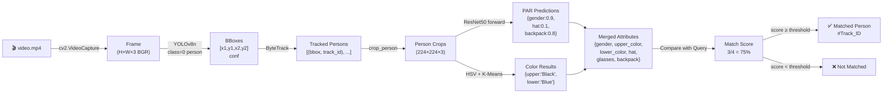
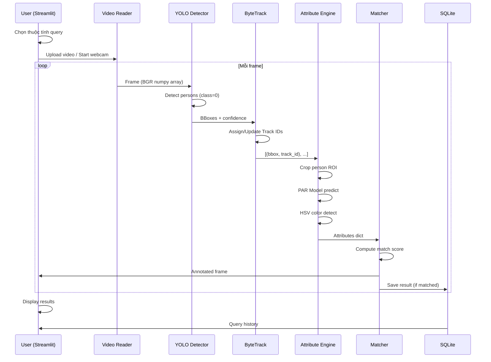
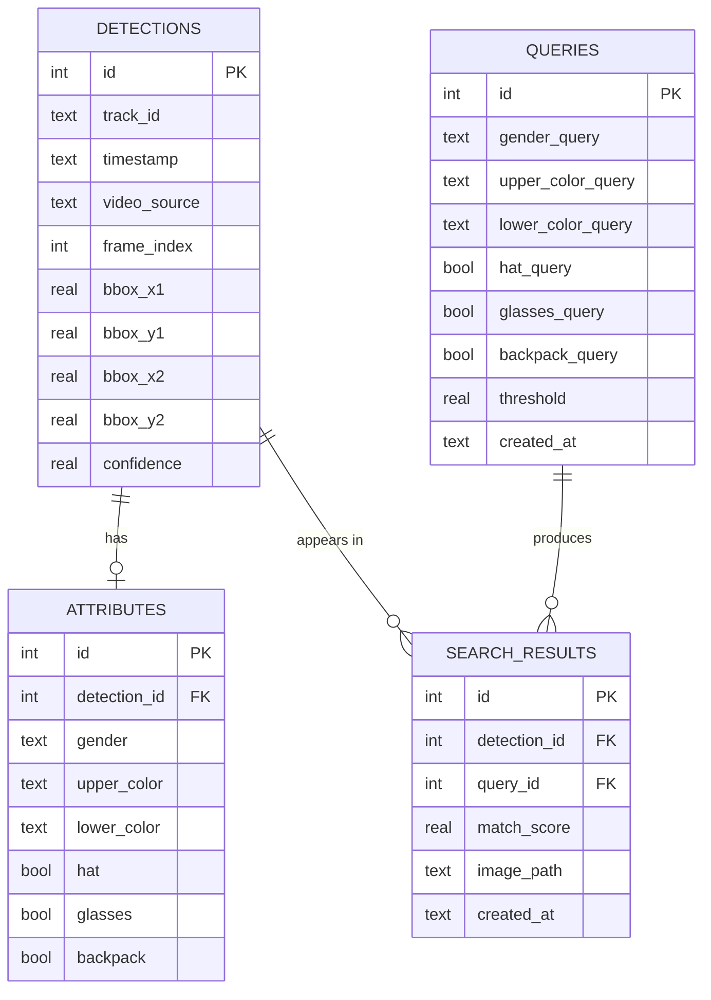

# Tài liệu Kiến trúc Hệ thống
## Person Detection and Retrieval System

---

## 1. System Architecture (Kiến trúc tổng thể)

```mermaid
flowchart TD
    A[📹 Video Input\nFile / Webcam] --> B

    subgraph DET["🔍 Detection Module"]
        B[YOLOv8n\nPretrained COCO]
        B --> |class=person\nbbox, confidence| C
    end

    subgraph TRK["🎯 Tracking Module"]
        C[ByteTrack\nvia Ultralytics]
        C --> |Track ID\nổn định qua frames| D
    end

    subgraph CROP["✂️ Crop Module"]
        D[Person ROI Extractor\n224×224 resize]
    end

    D --> E
    D --> F

    subgraph PAR["🧠 PAR Module"]
        E[ResNet50\nFine-tuned PA-100K]
        E --> |Gender\nHat, Glasses\nBackpack| G
    end

    subgraph COLOR["🎨 Color Module"]
        F[HSV Analysis\nK-Means Clustering]
        F --> |Upper Color\nLower Color| G
    end

    subgraph MATCH["⚖️ Matching Engine"]
        G[Attribute Comparator]
        G --> |Score = matched/required| H{Score ≥ Threshold?}
    end

    H --> |Yes ✅| I[Highlight\nGreen Bbox]
    H --> |No ❌| J[Gray Bbox]

    I --> K
    J --> K

    subgraph OUT["📊 Output"]
        K[Streamlit GUI\nVideo + Labels]
        K --> L[(SQLite DB\nHistory)]
        K --> M[📁 Export\nCrops + CSV]
    end

    style DET fill:#1a3a5c,stroke:#4a9eff
    style TRK fill:#1a3a5c,stroke:#4a9eff
    style CROP fill:#2d1a5c,stroke:#9a4aff
    style PAR fill:#1a5c2d,stroke:#4aff9a
    style COLOR fill:#1a5c2d,stroke:#4aff9a
    style MATCH fill:#5c3a1a,stroke:#ff9a4a
    style OUT fill:#5c1a1a,stroke:#ff4a4a
```



---

## 2. Data Flow Diagram (Luồng dữ liệu)



---

## 3. Processing Pipeline (Chi tiết từng bước)



---

## 4. PAR Model Architecture (Kiến trúc mô hình PAR)

```mermaid
flowchart TD
    I["Person Crop\n224×224×3"] --> R

    subgraph BB["ResNet50 Backbone (Frozen)"]
        R["Conv1 + BN + ReLU\n112×112×64"]
        R --> L1["Layer1: 3× Bottleneck\n56×56×256"]
        L1 --> L2["Layer2: 4× Bottleneck\n28×28×512"]
        L2 --> L3["Layer3: 6× Bottleneck\n14×14×1024"]
        L3 --> L4["Layer4: 3× Bottleneck\n7×7×2048"]
        L4 --> GAP["Global Average Pooling\n1×1×2048"]
    end

    GAP --> DROP["Dropout(0.5)"]
    DROP --> FC["FC Layer\n2048 → 512 → N_attrs"]

    subgraph HEAD["Classification Heads (Trainable)"]
        FC --> G["Gender\n2 classes\nSoftmax"]
        FC --> H["Hat\n1 class\nSigmoid"]
        FC --> GL["Glasses\n1 class\nSigmoid"]
        FC --> BP["Backpack\n1 class\nSigmoid"]
    end

    style BB fill:#1a3a1a,stroke:#4aff4a
    style HEAD fill:#3a1a3a,stroke:#ff4aff
```



**Giải thích**:
- **Backbone (ResNet50)**: Đóng băng (frozen) các layer đầu — giữ nguyên feature đã học từ ImageNet
- **Global Average Pooling**: Nén feature map 7×7×2048 → vector 2048 chiều
- **Dropout**: Tránh overfitting
- **FC + Sigmoid/Softmax**: Multi-task learning — mỗi attribute một head riêng

---

## 5. Training Pipeline (Google Colab)

```mermaid
flowchart TD
    DS["PA-100K Dataset\n100,000 ảnh + annotation.mat"] --> DL

    subgraph PREP["Data Preparation"]
        DL["DataLoader\nbatch_size=32\nshuffle=True"]
        DL --> AUG["Data Augmentation\n- RandomHorizontalFlip\n- ColorJitter\n- RandomCrop"]
        AUG --> NORM["Normalize\nmean=[0.485,0.456,0.406]\nstd=[0.229,0.224,0.225]"]
    end

    NORM --> MODEL

    subgraph TRAIN["Training Loop (30 epochs)"]
        MODEL["ResNet50 + FC Heads\n(ImageNet pretrained)"]
        MODEL --> LOSS["Multi-Task Loss\nBCE (binary attrs)\n+ CE (gender)"]
        LOSS --> OPT["Adam Optimizer\nlr=1e-4 backbone\nlr=1e-3 FC heads"]
        OPT --> SCH["LR Scheduler\nStepLR(step=10, γ=0.1)"]
        SCH --> |"next epoch"| MODEL
    end

    SCH --> EVAL

    subgraph EVAL["Evaluation"]
        EVAL["Validate on\n10,000 ảnh"]
        EVAL --> BEST{"Best mA?"}
        BEST --> |Yes| SAVE["Save par_resnet50.pth"]
        BEST --> |No| CONT["Continue training"]
    end

    SAVE --> DOWN["Download về máy\nmodels/par/par_resnet50.pth"]
```

---

## 6. Database ERD (SQLite Schema)



---

## 7. Matching Score Formula

```
                    Σ [attr_i_correct × weight_i]
  Score =  ─────────────────────────────────────────
                    Σ [attr_i_specified × weight_i]

Trong đó:
  attr_i_correct   = 1 nếu attribute thứ i dự đoán đúng với query
  attr_i_specified = 1 nếu người dùng đã chỉ định attribute thứ i
  weight_i         = trọng số của attribute (mặc định = 1.0)

Ví dụ:
  Query: {gender=Male, upper=Black, lower=Black, backpack=Yes}
  Person: {gender=Male ✓, upper=Black ✓, lower=Gray ✗, backpack=Yes ✓}

  Score = (1 + 1 + 0 + 1) / (1 + 1 + 1 + 1) = 3/4 = 75%
```
